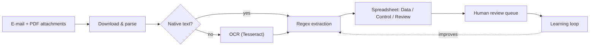
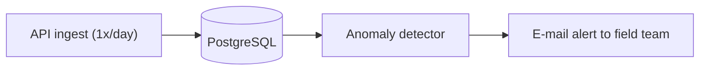

<h1 align="center">Hi, I'm Vinicius 👋</h1>

<h3 align="center">Data & BI Analyst · Data Automation & Apps · Geotechnologies</h3>

  I turn data into decisions — building BI dashboards, automation pipelines,
  apps, LLM tools and statistical models that run in production.

  📍 Águas da Prata – SP, Brazil &nbsp;·&nbsp;
  🏢 Data & BI @ <strong>Grupo JCN</strong>
   
  🔗 <a href="https://www.linkedin.com/in/vinicius-quintino">LinkedIn</a> &nbsp;·&nbsp;
  📧 viniciusquintino33@gmail.com &nbsp;·&nbsp;
  🇧🇷 <a href="README.pt-BR.md">Versão em Português</a>

  
  
  
  
  
  
  

---

## 🚀 What I do

I sit between **data, operations, and the ERP**. Day to day I:

- 📊 **Build BI** — Power BI dashboards and a reusable visual design system for the operation.
- 🤖 **Automate** — Python/ETL pipelines that remove manual, error-prone work (OCR, e-mail, file conversion).
- 📱 **Ship apps** — offline-first apps and internal tools for the operation.
- 🧠 **Apply AI & stats** — LLM assistants (natural-language → SQL) and statistical yield models.
- 🛰️ **Use geotechnologies** — QGIS/GIS, NDVI and spatial geometry for richer analysis.
- 🔌 **Integrate the ERP** — read-only SAP Business One (Service Layer / HANA) into dashboards and tools.

---

## 🧩 Featured Case Studies

> Internal projects built at **Grupo JCN** (an agribusiness group). Descriptions
> focus on functionality and impact — no proprietary data, credentials or numbers
> are shown.

### 1. AppInsumo — Offline-first PWA for input applications

A **mobile app** for the field operator that works **fully offline** — the data
lives on the device.

- **Consult** the application history per field plot, in the field, without opening the ERP.
- **Create application recommendations**: farm → crop → plots → operation → inputs.
- **Local stock control** with automatic **FEFO** lot consumption and expiry alerts.
- **Heatmap** of plots by time since last application.

`React 18` · `TypeScript` · `Vite` · `Tailwind` · `IndexedDB (idb-keyval)` · `Leaflet` · `SheetJS` · `Capacitor`

---

### 2. Agro Assistant — Natural-language → SQL bot

Ask farm questions in plain Portuguese; an LLM translates them to SQL, runs them
against the real bases, and answers back in Portuguese.

> *"How many aerial sprayings did farm X have in the cotton season?"* → the bot
> writes the query, runs it and replies with the number in a sentence.

- Multi-provider LLM (swappable), conversation history, Telegram + CLI interfaces.
- Core (`NL→SQL`) decoupled from the I/O channel — ready to move to WhatsApp.

`Python` · `LLM (multi-provider)` · `SQL` · `pandas` · `python-telegram-bot`

---

### 3. Cotton Yield Projection — statistical model

A season-ahead yield projection for cotton, combining agronomic history with
remote sensing.

- **NDVI** curves, **rainfall** and **radiation** as drivers.
- **Mixed-effects models** (per plot / variety) with **backtesting** against a naïve baseline.
- Outputs maps and an executive report for planning.

`Python` · `statsmodels (mixed models)` · `pandas` · `GeoPandas` · `NDVI / remote sensing`

---

### 4. Aerial Spraying OCR Pipeline — automation + human-in-the-loop

Turns spraying PDFs received by e-mail into a clean, reviewed spreadsheet — and
**learns from the corrections**.

- Native-text first, OCR fallback for scanned PDFs.
- Review queue (raw vs. corrected) feeds a learning file that improves later extractions.

`Python` · `Tesseract OCR` · `openpyxl` · `Outlook automation`

---

### 5. Beneficiamento Dashboard — SAP, read-only

A local Streamlit board that reads the **SAP Business One Service Layer**
(strictly `GET`-only) to show cotton processing **in production now**, the **last
finished** batch and the **upcoming queue**, with a yield projection.

`Python` · `Streamlit` · `SAP Service Layer (read-only)` · `pandas`

---

### 6. Weather-Station Monitoring — data engineering + alerting

A daily job that detects which weather stations **failed to report** and e-mails
the field team so they can check the hardware.

`Python` · `PostgreSQL` · `SMTP` · `Windows Task Scheduler`

---

### 7. Daily Report Bots — Power Automate + WhatsApp

A set of automated flows that deliver daily operational reports straight to the
team's **WhatsApp** — each one with a **Power BI report attached covering the full
season history**, so no one needs to open a dashboard to stay informed.

- **Rainfall** — accumulated rainfall over the last 1, 3 and 7 days.
- **Harvest** — daily harvest by plot and farm with that day's yield, plus the
  season-to-date accumulated figures.
- **Planting** — planted area (ha) per day by plot and farm, plus the
  season-to-date accumulated area.

`Power Automate` · `WhatsApp` · `Power BI`

---

## 💼 Freelance Project

### Auto-Parts Catalog Unification — e-commerce

An independent project for an **auto-parts e-commerce** client who had **12
separate catalogs** scattered across websites, desktop software and PDFs. I
consolidated all of them into a **single database with a visual interface**.

- **Web scraping** to pull data from websites.
- **Python automations** to capture values from software.
- **OCR** to extract data from PDF catalogs.
- **Python scripts** to clean, normalize and merge everything into one source of truth.

`Python` · `Web Scraping` · `OCR` · `pandas` · `SQL`

---

## 🗂️ More projects

| Project | What it does | Stack |
|---|---|---|
| **Cropwise Loader** | Converts the system's spraying export into the bulk-import template for Cropwise Protector — zero manual retyping. | `Python` · `openpyxl` |
| **BI Design System** | Redesign of the operation's dashboards (cotton processing, silo, harvest, HVI, planting, weather) with a reusable visual language. | `Power BI` · `HTML mockups` |
| **Outlook Automations** | Auto-download and organize attachments and certificates from e-mail. | `Python` · `Outlook` |

---

## 🛠️ Tech & Tools

  
  
  
  
  
  
  
  
  
  
  
  
  
  
  

---

<em>Transforming data into clear decisions.</em>

