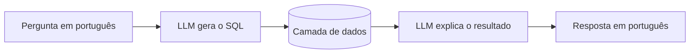
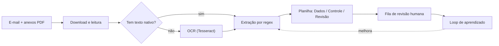
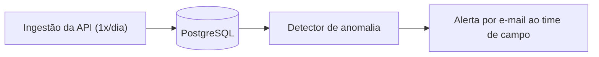

<h1 align="center">Olá, eu sou o Vinicius 👋</h1>

<h3 align="center">Analista de Dados & BI · Automação e Apps de Dados · Geotecnologias</h3>

  Transformo dados em decisões — construindo dashboards de BI, pipelines de
  automação, apps, ferramentas com IA e modelos estatísticos.

  📍 Águas da Prata – SP, Brasil &nbsp;·&nbsp;
  🏢 Dados & BI no <strong>Grupo JCN</strong>
   
  🔗 <a href="https://www.linkedin.com/in/vinicius-quintino">LinkedIn</a> &nbsp;·&nbsp;
  📧 viniciusquintino33@gmail.com &nbsp;·&nbsp;
  🇺🇸 <a href="README.md">English version</a>

  
  
  
  
  
  
  

---

## 🚀 O que eu faço

Atuo na fronteira entre **os dados, a operação e o ERP**. No dia a dia eu:

- 📊 **Construo BI** — dashboards em Power BI e um design system visual reutilizável para a operação.
- 🤖 **Automatizo** — pipelines em Python/ETL que eliminam trabalho manual e sujeito a erro (OCR, e-mail, conversão de arquivos).
- 📱 **Entrego apps** — apps offline-first e ferramentas internas para a operação.
- 🧠 **Aplico IA e estatística** — assistentes com LLM (linguagem natural → SQL) e modelos estatísticos de produtividade.
- 🛰️ **Uso geotecnologias** — QGIS/GIS, NDVI e geometria espacial para análises mais ricas.
- 🔌 **Integro o ERP** — SAP Business One somente leitura (Service Layer / HANA) em dashboards e ferramentas.

---

## 🧩 Estudos de Caso em Destaque

> Projetos internos construídos no **Grupo JCN** (grupo do agronegócio). As
> descrições focam em funcionalidade e impacto — nenhum dado proprietário,
> credencial ou número real é exposto.

### 1. AppInsumo — PWA offline-first para aplicações de insumos

**App mobile** para o operador que funciona **totalmente offline** — os dados
ficam no próprio aparelho.

- **Consultar** o histórico de aplicações por talhão, em campo, sem abrir o ERP.
- **Criar recomendações de aplicação**: fazenda → cultura → talhões → operação → insumos.
- **Controle de estoque local** com baixa automática de lotes por **FEFO** e alerta de validade.
- **Heatmap** dos talhões por tempo desde a última aplicação.

`React 18` · `TypeScript` · `Vite` · `Tailwind` · `IndexedDB (idb-keyval)` · `Leaflet` · `SheetJS` · `Capacitor`

---

### 2. Assistente Agro — bot de linguagem natural → SQL

Pergunte sobre as fazendas em português; um LLM traduz para SQL, executa nas
bases reais e responde em português.

> *"Quantas pulverizações aéreas teve a fazenda X na safra de algodão?"* → o bot
> escreve a consulta, executa e responde com o número em uma frase.

- LLM multi-provedor (intercambiável), histórico de conversa, interfaces Telegram + CLI.
- Núcleo (`NL→SQL`) desacoplado do canal de I/O — pronto para migrar para o WhatsApp.

`Python` · `LLM (multi-provedor)` · `SQL` · `pandas` · `python-telegram-bot`

---

### 3. Projeção de Produtividade do Algodão — modelo estatístico

Projeção de produtividade do algodão para a safra, combinando histórico
agronômico com sensoriamento remoto.

- Curvas de **NDVI**, **chuva** e **radiação** como drivers.
- **Modelos de efeitos mistos** (por talhão / variedade) com **backtest** contra um baseline ingênuo.
- Gera mapas e um relatório executivo para planejamento.

`Python` · `statsmodels (modelos mistos)` · `pandas` · `GeoPandas` · `NDVI / sensoriamento remoto`

---

### 4. Pipeline de OCR de Pulverizações — automação + revisão humana

Transforma os PDFs de pulverização recebidos por e-mail numa planilha limpa e
revisada — e **aprende com as correções**.

- Texto nativo primeiro, OCR como fallback para PDFs escaneados.
- A fila de revisão (bruto vs. corrigido) alimenta um arquivo de aprendizado que melhora as extrações seguintes.

`Python` · `Tesseract OCR` · `openpyxl` · `Automação de Outlook`

---

### 5. Painel de Beneficiamento — SAP, somente leitura

Painel local em Streamlit que lê a **Service Layer do SAP Business One**
(estritamente `GET`) para mostrar o beneficiamento de algodão **em produção
agora**, o **último concluído** e a **fila dos próximos**, com projeção de
rendimento.

`Python` · `Streamlit` · `SAP Service Layer (somente leitura)` · `pandas`

---

### 6. Monitoramento de Estações Meteorológicas — engenharia de dados + alerta

Rotina diária que detecta quais estações **deixaram de reportar** e avisa o time
de campo por e-mail para verificar o equipamento.

`Python` · `PostgreSQL` · `SMTP` · `Agendador de Tarefas do Windows`

---

### 7. Bots de Relatório Diário — Power Automate + WhatsApp

Conjunto de fluxos automatizados que entregam relatórios operacionais diários
direto no **WhatsApp** da equipe — cada um com um **Power BI em anexo com todo o
histórico da safra**, sem ninguém precisar abrir um dashboard para se manter
informado.

- **Chuva** — chuva acumulada nos últimos 1, 3 e 7 dias.
- **Colheita** — colheita diária por talhão e fazenda com a produtividade daquela
  colheita, mais o acumulado da safra.
- **Plantio** — área plantada por dia (ha) por talhão e fazenda, mais o acumulado
  da safra.

`Power Automate` · `WhatsApp` · `Power BI`

---

## 💼 Projeto Freelance

### Unificação de Catálogos de Autopeças — e-commerce

Projeto particular para um cliente de **e-commerce de autopeças** que tinha **12
catálogos diferentes**, espalhados em sites, softwares e PDFs. Unifiquei todos em
um **único banco de dados com interface visual**.

- **Web scraping** para coletar dados de sites.
- **Automações em Python** para capturar valores de softwares.
- **OCR** para extrair dados dos catálogos em PDF.
- **Scripts em Python** para limpar, padronizar e unificar tudo numa fonte única.

`Python` · `Web Scraping` · `OCR` · `pandas` · `SQL`

---

## 🗂️ Outros projetos

| Projeto | O que faz | Stack |
|---|---|---|
| **Cropwise Loader** | Converte o export de pulverizações do sistema no template de importação em massa da Cropwise Protector — zero redigitação. | `Python` · `openpyxl` |
| **Design System de BI** | Redesenho dos dashboards da operação (beneficiamento, silo, colheita, HVI, plantio, clima) com uma linguagem visual reutilizável. | `Power BI` · `mockups HTML` |
| **Automações de Outlook** | Baixa e organiza automaticamente anexos e certificados do e-mail. | `Python` · `Outlook` |

---

## 🛠️ Tecnologias & Ferramentas

  
  
  
  
  
  
  
  
  
  
  
  
  
  
  

---

<em>Transformando dados em decisões claras.</em>

